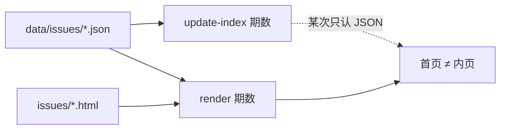
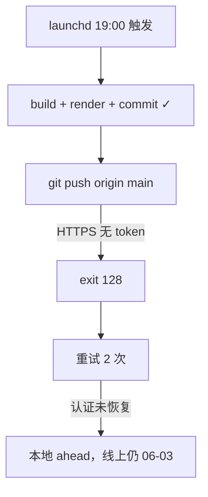

# Newsletter 发布踩坑复盘

> 本文记录两起真实发布事故：期数不一致（2026-05-22）与自动发布断更（2026-06-04/05）。

---

# 事故一：首页与内页期数不一致（2026-05-22）

## 现象

2026-05-22 发布流水线跑完后，验收发现：

| 位置 | 05-22 显示 |
|------|-----------|
| `index.html` 归档列表 | `Issue 03` |
| `issues/ai-builders-digest-2026-05-22-rerun.html` 顶部条带 | `第 04 期` |

同期 `05-20`、`05-21` 内页也分别偏了 1 期（显示 `第 02/03 期`，与首页口径对不上）。

## 背景：这期的编号口径

当时已确认的**业务口径**（用户最终拍板）：

```
2026-05-19 → Issue 01（仅有 HTML，无 JSON）
2026-05-20 → Issue 02
2026-05-21 → Issue 03
2026-05-22 → Issue 04
```

`issues/ai-builders-digest-2026-05-19-rerun.html` 是**有意保留**的 legacy 第一期，不是 stray 垃圾文件。

## 根因

不是「扫描 HTML 就一定错」，而是**两条流水线用了不一致的期数来源**：

1. **渲染脚本** `src/render/render-ai-builders-digest.js` 的 `collectIssueDates()` 会扫描：
   - `data/issues/*.json`
   - `issues/*.html`（含 `-rerun`）

2. **首页归档脚本** `src/archive/update-index-archive.js` 在某次中间修复里曾改为**只按 JSON 重建**，与渲染侧不同步。

3. 中间态下，`05-19` 这条 HTML-only 条目在首页归档里被删掉过，但 `issues/` 里文件还在 → 渲染仍把它算进日期集合 → `05-22` 被算成第 04 期，而首页只按 3 条 JSON 显示 Issue 03。



## 错误的第一次修复（教训）

Agent 第一反应：「stray HTML 干扰编号」→ 把 `collectIssueDates()` 改成**只扫 JSON**。

结果：

- `05-20/21/22` 被重编号为 `01/02/03`
- **丢掉了** `05-19 = Issue 01` 的业务口径

用户随即纠正：「`05-19` 就是第一期，`05-22` 应该是第 04 期。」

**教训：** 改编号逻辑前，先确认有没有 **HTML-only 的合法历史期**，不要默认「只认 JSON」。

## 正确解法

### 1. 统一期数来源

`render` 与 `update-index` 必须使用**同一套日期集合**：

- JSON 日期：`data/issues/ai-builders-digest-YYYY-MM-DD.json`
- 已发布 HTML 日期：`issues/ai-builders-digest-YYYY-MM-DD-rerun.html`（含无 JSON 的 legacy 期）

按日期 chronological 排序后，从 `01` 递增编号。

### 2. 重渲染受影响的内页

修逻辑后，对 `05-20`、`05-21`、`05-22` 全部重跑 render，不能只改当天一期。

### 3. 补回首页丢失的 05-19 条目

因中间步骤曾从 `index.html` 删掉 `05-19`，`parseExistingArchive()` 无法凭空恢复 → **手动补回**归档条目并校正 `Issue 01/02/03/04`。

### 4. 发布前验收（必做）

```bash
# 渲染 + 更新首页后，核对每一期
rg 'archive-issue|archive-date' index.html
rg 'edition-strip-text|data-issue-number' issues/ai-builders-digest-2026-05-22-rerun.html
```

**规则：** 同一日期的 `Issue NN`（首页）必须等于 `第 NN 期`（内页条带）。

## 涉及文件

| 文件 | 角色 |
|------|------|
| `src/render/render-ai-builders-digest.js` | `collectIssueDates()`、`formatIssueNumber()` |
| `src/archive/update-index-archive.js` | `loadJsonEntries()`、`parseExistingArchive()`、归档重编号 |
| `index.html` | 首页往期列表（曾需手动补 legacy 条目） |
| `issues/ai-builders-digest-2026-05-19-rerun.html` | HTML-only 第一期（legacy） |

## 下次怎么避坑

1. **Review 先于 commit**：发布流水线最后一步永远是「首页 vs 内页期数对照」，不要只看 `git status`。
2. **改编号逻辑 = 全量重渲染**：动 `collectIssueDates` 或 `update-index` 后，重跑所有受影响的 `render` + `update-index`。
3. **legacy 条目要显式记录**：HTML-only 期（如 `05-19`）写在 `AGENTS.md` 或本 solutions 里，避免被当成 stray 文件删掉。
4. **两条脚本同改同测**：禁止只改 render 或只改 index 其中之一。
5. **若未来坚持 JSON-only**：必须先为 `05-19` 补 `data/issues/*.json`，再切换逻辑。

## 最终验收（2026-05-22 会话末）

```
05-19 → Issue 01 / 第 01 期 ✓
05-20 → Issue 02 / 第 02 期 ✓
05-21 → Issue 03 / 第 03 期 ✓
05-22 → Issue 04 / 第 04 期 ✓
```

已 commit `76912e1` 并 push 到 `origin/main`。

## 相关

- 项目总则：`AGENTS.md` →「期数编号规则」
- 原始会话：Cursor transcript `9dc700d6`（2026-05-22 续跑 05-22 期）

---

# 事故二：2026-06-04/05 自动发布断更（用户投诉）

## 现象

用户反馈线上最新一期停在 **2026-06-03**，6 月 4 日、5 日都没有更新。读者以为「自动化没跑」或「内容没生成」。

## 实际状态（误导性很强）

定时任务**其实跑了**，内容也**本地生成成功**了：

| 日期 | 本地 JSON | 本地 HTML | 本地 commit | 远端 GitHub |
|------|-----------|-----------|-------------|-------------|
| 06-04 | ✓ `ea1efa6` | ✓ | ✓ | ✗ 未 push |
| 06-05 | ✓ `b290c4b` | ✓ | ✓ | ✗ 未 push |

所以这不是「没更新」，而是 **「更新了但没上线」**——GitHub Pages 只跟远端 `main` 走，本地 ahead 2 commits 对用户完全不可见。

## 根因

**`git push` 在 launchd 无交互环境里认证失败。**

1. 自动发布跑在 `Newsletter-automation-live`（launchd 工作目录），每天约 19:00 CST 触发（`RunAtLoad` + 日历间隔）。
2. 流水线顺序：build JSON → render → update index → **commit → push**。
3. 06-04、06-05 都在 commit 成功后，push 以 **exit code 128** 失败。

错误日志（`~/Library/Logs/follow-builders-newsletter.error.log`）：

```
fatal: could not read Password for 'https://luolan0214@github.com': Device not configured
```

远端配置为 HTTPS：`https://luolan0214@github.com/luolan0214/follow-builders-newsletter.git`

launchd 进程**不能弹密码框、不能走交互式 credential helper**，于是 push 连续失败。

## 与「个人号 / 公司号切换」的关系

当时 `gh` 同时登录了多个 GitHub 账号，**当前激活账号**是 `sunruonan0214`（公司），而仓库 owner 是 `luolan0214`（个人）。公司账号对该仓库只有 **READ** 权限，无法 push。

终端里手动操作有时能成功（Keychain / 交互式 gh 会话），但 **定时任务不会继承你当前激活的 gh 账号**，也不会等你输入密码。账号切换后，HTTPS 凭据和 launchd 环境更容易脱节。



## 为什么重试没自愈

`run-scheduled-newsletter-publisher.sh` 的重试只是再次执行 pull/push。认证状态没修好，重试多少次都一样失败。06-05 日志里还能看到它在反复尝试 sync 积压的 06-03、06-04 push，全部 `Current branch main is up to date`（本地已 commit，但远端没动）。

## 修复（2026-06-06 会话）

1. **紧急补推**：用 `gh auth token --user luolan0214` 拿到个人号 token，一次性 push 积压的 `ea1efa6`、`b290c4b`。
2. **脚本加固**：新增 `scripts/github-auth-helper.sh`，push/pull 改为按**仓库 owner**（`luolan0214`）取 token，不再依赖「当前激活的 gh 账号」。
3. **06-06 验证**：修复后当天自动发布 `2d375b7` push 成功，日志出现 `Published 2026-06-06 successfully`。

涉及文件（在 `Newsletter-automation-live`）：

| 文件 | 改动 |
|------|------|
| `scripts/github-auth-helper.sh` | 新增：按 owner 取 `gh auth token` |
| `scripts/publish-daily-newsletter.sh` | push/pull 走 authenticated helper |
| `scripts/run-scheduled-newsletter-publisher.sh` | 同步 pending push 也走 helper |

## 日常监控（避免再次断更）

```bash
# 1. 看最近自动发布是否成功
tail -30 ~/Library/Logs/follow-builders-newsletter.log

# 2. 看有没有 push 认证错误
grep -E 'exit code 128|Device not configured|fatal:' \
  ~/Library/Logs/follow-builders-newsletter.error.log | tail -10

# 3. 本地是否积压未推送提交
git -C ~/code/Newsletter-automation-live status --short --branch
```

**告警信号：**

- 日志出现 `failed with exit code 128`
- `main` 显示 `ahead N` 且持续多天
- 线上最新日期 < 本地最新 JSON 日期

## 下次怎么避坑

1. **切换 GitHub 账号后**，跑一遍 `SKIP_AGENT=1 SKIP_PUSH=0` 的手动发布，确认 launchd 环境能 push。
2. **不要假设「终端能 push = 定时任务能 push」**——两套环境凭据来源不同。
3. **每周扫一眼日志**，不要等用户投诉才发现 `ahead` 积压。
4. 个人号/公司号并存时，发布脚本应**绑定仓库 owner**，不要依赖全局 active gh user。
5. launchd 前提：电脑开机 + 已登录图形会话（睡眠/关机则当天不会跑）。

## 相关

- 自动发布仓库：`~/code/Newsletter-automation-live`（launchd 实际指向这里）
- launchd plist：`~/Library/LaunchAgents/com.luolan.follow-builders-newsletter.plist`
- 原始会话：Cursor transcript `cf1e44a1`（2026-06-06 用户投诉 + 补推修复）
